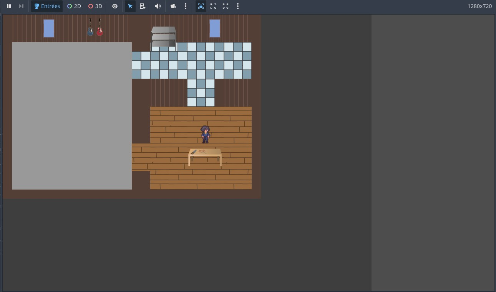
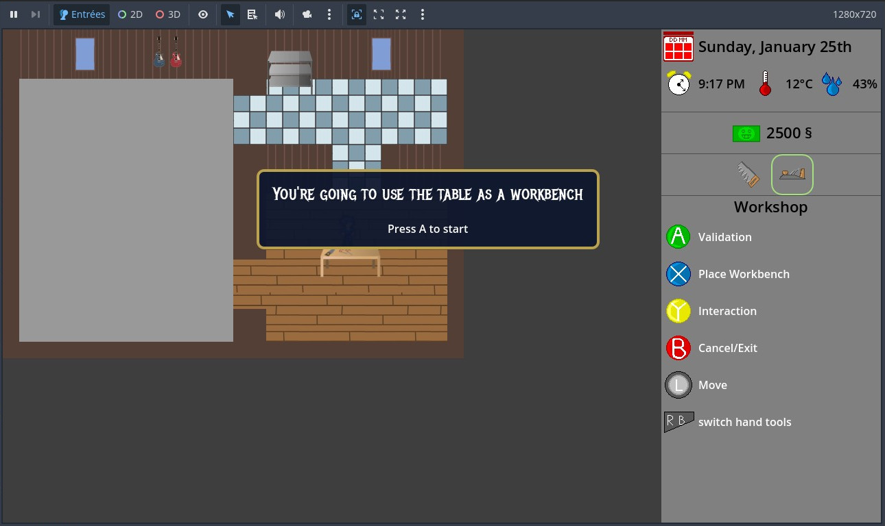
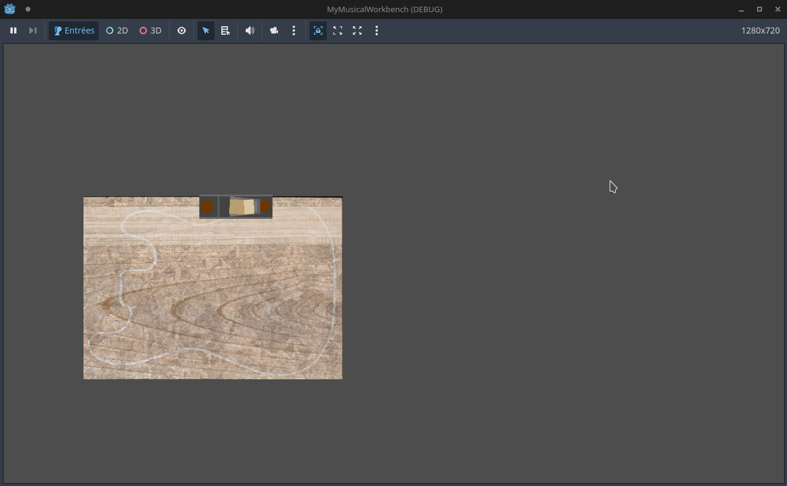

# My Musical workbench
A hands-on journey into lutherie

🎥 Demo video  
https://github.com/vince-bourgmayer/MyMusicalWorkbench/raw/main/screenshots/MyMusicalWorkbench_demo_03012026_compressed.mp4

Early prototype screenshot

## What it is
This repository is a POC for a small 2D indie game prototype about crafting stringed musical instruments.
It is intentionally kept raw.

### Game mechanics
- Workshop interaction  
  The player can place a workbench in the workshop and interact with it to access crafting actions.
- Manual crafting  
  Crafting is based on manual tool interactions, focusing on gesture, precision, and feedback rather than abstract timers.
- Handsaw mini-game  
  A playable handsaw mechanic allows the player to define a cut and manually perform the sawing gesture to shape a guitar body blank.
- Handplane mini-game  
  A playable handplane mechanic allows the player to use a jackplane to plane the wood

#### Ideas
- Workshop management: Buy, and place tools where you want. Set up show room, painting area, etc. 
- Customer management: Get request and try to build instrument that match the best
- Crafting guitar: mini-games for tasks like sanding, sawing, or tuning the guitar.
- Handling weather condition: keep you workshop dry, free of dust, not too warm nor cold

## Why this project exists
This project was created as a way to stay active as a developer while exploring the intersection between technology and artistic craftsmanship.

Through lutherie-inspired gameplay, it aims to share an experience that values experimentation, learning by doing, and overcoming the fear of failure.

## Project status
Early prototype / design phase.  
The project is currently focused on core mechanics and experimentation.

🔧 Current focus: Controls UX  
🧭 Overall direction and planned milestones are described in [ROADMAP.md](ROADMAP.md).

## Concept, Design & Creative Direction :
© Vincent Bourgmayer

## Contributions
Issues welcome (bug reports / ideas)
PRs optional but expected to be messy :)

### How to run
1. Open with Godot 4.5.1
2. Run main scene: `Game.tscn`
3. Interact with the workbench

## License
The code located in the `src` folder is released under the MIT License.  
All assets (art, audio, text) are **not** covered by the MIT License and remain proprietary.
Specific licenses for assets can be found in the assets folders alongside the corresponding files.

## Credits
- Thanks to Kettoman for the character's spritesheet: [itch.io](https://kettoman.itch.io/free-pixel-characters-pack-32x32)
- Thanks to Open Window for the metal mania font [1001fonts.com](https://www.1001fonts.com/metal-mania-font.html)
- Thanks to SOULFULJAMTRACKS for the saw sound effect [Hand Saw 5 FX](https://pixabay.com/sound-effects/film-special-effects-hand-saw-5-fx-378591)
- Thanks to Godot team! [Godot engine](https://godotengine.org/fr/)
